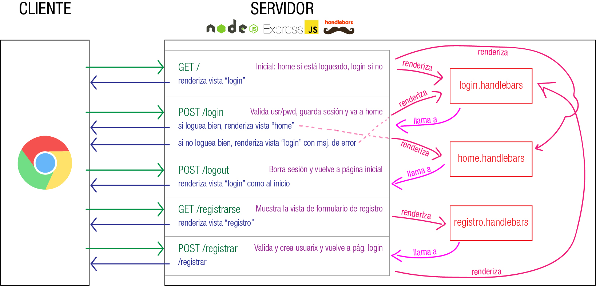

# Login

Breve explicación de estrategias para manejar logueo de usuarixs.

### Sesiones y cookies

Las peticiones HTTP, naturalmente, no conservan datos. Dicho en términos más técnicos, no tienen estado (en nuestros habituales anglicismos, son "stateless"). Es decir que entre un request y otro request no se comparte información (a menos que nosotros explícitamente la reenviemos, pasando datos por query string o en el body de un request, por ejemplo).

Una manera de lidiar con eso es utilizando sesiones o cookies. Son dos formas bastante parecidas, en ambos casos se trata de que se guarde información _en algún lugar_ y que se pueda acceder en distintos requests. La diferencia entre sesiones y cookies es que las sesiones guardan la información en el servidor y las cookies en el cliente (browser).

Contras de cada una: la info de sesión se pierde si reinicio el servidor, la info de las cookies podría ser accesible/editable/borrable del lado del cliente. Para un uso sencillo como nuestro caso, diría que da igual. Usaremos la librería `express-session` (la que tomo para este ejemplo) o `cookie-session` según el caso.

En cualquier caso, siempre vamos a usar una o más "claves", definidas por nosotrxs, que son para codificar los datos y que el servidor sea el único que los pueda decodificar. Suele usarse alguna frase que no tenga nada que ver, que no sea "adivinable" fácilmente, digamos.

### El uso

Típicamente vamos a tener una API POST `/login` o algo así donde recibimos los datos de usuarix/password. Los recibimos en el body, que puede ser de tipo `application/json` (si es un login AJAX que envía un JSON, x ej) o `application/x-www-form-urlencoded` (si es un form) y que el middleware que configuramos con el body-parser nos disponibiliza en un objeto body dentro del request (req.body). En el callbak de ese app.post() validamos que los datos sean correctos. Ya que estamos, ¿cómo se valida eso? Básicamente tendríamos dos maneras:

1. Consultar a la base de datos la info de esx usuarix (un `.find( {usuarix: "pepe" } )` o `.findOne( {usuarix: "pepe" } )`) que nos devolvería el documento de la colección de usuarixs que contiene alguna propiedad "clave", "password" o como le hayamos puesto, y verificamos que ese valor sea igual al que recibimos en el body.

2. Consultar a la base de datos con los dos valores (un `.find( { usuarix: "pepe", password: "pupu" } )` o `.findOne( { usuarix: "pepe", password: "pupu" } )`), si trajo algún resultado los valores son correctos, si no trajo ninguno es porque alguno de los dos valores no coincidió.

Si vamos por la vía 1, podemos distinguir si el problema es usuarix o clave. Consultamos usuarix, si no está ya sabemos que está mal ese nombre de usuarix, si existe verificamos la clave. Tenemos 3 salidas distintas, digamos (usuarix mal, usuarix bien y clave mal, usuarix bien y clave bien). Por la vía 2 validamos todo junto y tenemos dos salidas posibles (usuarix y/o clave mal, usuarix y clave bien). Ese 2do caso es más corto en el código, pero cualquiera de los dos está bien.

Nótese que en ambos casos podríamos usar `find` o `findOne`. La función `findOne` solo retorna la primer coincidencia que encuentre. En este caso sería mejor porque buscamos una sola (si hicimos las validaciones correspondientes cuando se registra unx usuarix, no tenemos dos nombres de usuarix iguales), y además no necesitamos hacer la conversión a Array (el findOne nos retorna un elemento solo).

Volviendo, entonces, nuestra API valida usuarix y clave. Si la validacion está mal, podemos redirigir a otra página o responder el error (qué querramos hacer dependerá si estamos usando AJAX o form). Si está bien, almacenamos la información de usuarix en la sesión o en la cookie, es indistinto. En definitiva el concepto es el mismo, el de "sesión", la idea de que unx usuarix está en una sesión de trabajo.

Después, cada vez que nos llegue un GET a una ruta de la página que sea "privada" (o sea, que requiera que haya unx usuarix logueado), lo primero que hacemos es validar la sesión (muy fácilmente con las librerías que mencioné), y si no estuviera logueado, podemos redirigir a la página de login. Si está logueado, además, ya podemos tomar de la sesión los datos, si por ejemplo queremos pasarle el nombre de usuarix a la vista para ponerlo en la cabecera o algo así.

## El ejemplo

Es un ejemplo de registro/login básico con una vista "home" para usuarixs logueadxs. Usamos la librería `express-session`. Voy con sesión y no cookies porque es un poco más sencillo el código, pero es casi igual la implementación.

Tiene tres páginas:

- `client/login.html`: la página inicial con el form de login.
- `client/registro.html`: la página de registro.
- `client/home.html`: la página home de usuarix logueadx

Intento diagramar la idea de las APIs:

### Las vistas

Iniciamos la app en la vista "login". Cada intento fallido de login nos volverá a mostrar esa vista de login pero agregando algún mensaje indicando error.

Si clickeamos en "registrarse" vamos a la vista "registro". Cada intento fallido de registro nos volverá a mostrar esa vista de registro pero agregando algún mensaje indicando error. En caso de registro exitoso, nos vuelve a mostrar la vista de login.

Cuando el login sea exitoso, nos mostrará la vista de home. Si se clickea en el botón "Logout", nos vuelve a llevar a la vista de login (que es la inicial).

### Los usuarios

En este caso estoy usando un array como lista de usuarios, y solo tendrá validez mientras no se reinicie el server. En un caso bien resuelto, esto debería estar montado en una base de datos.

### Las sesiones

La idea es que tengamos un elemento "usuarix" dentro del objeto "req.session" que, cuando hay alguien logueadx, existe y contiene el nombre de usuarix, y si no hay nadie logueadx no está.

La única operación que guarda un valor en req.session.usuarix es el login exitoso.

El logout destruye ese elemento de sesión.

Ante algunos errores, por ejemplo, también se destruye el elemento de sesión para evitar que quede un usuario logueado.